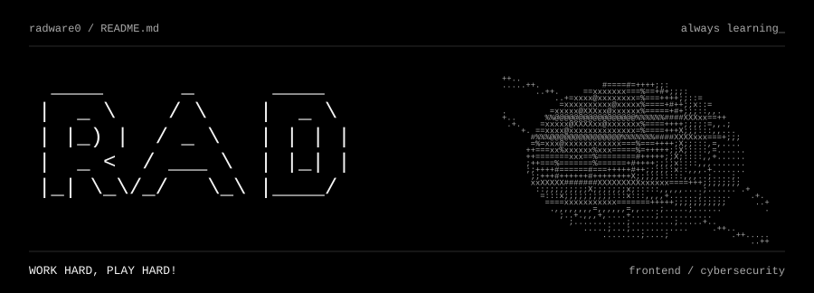
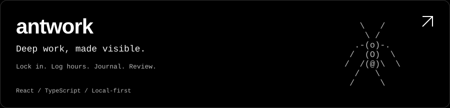
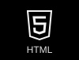
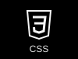
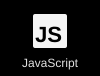
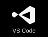
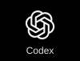
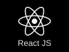
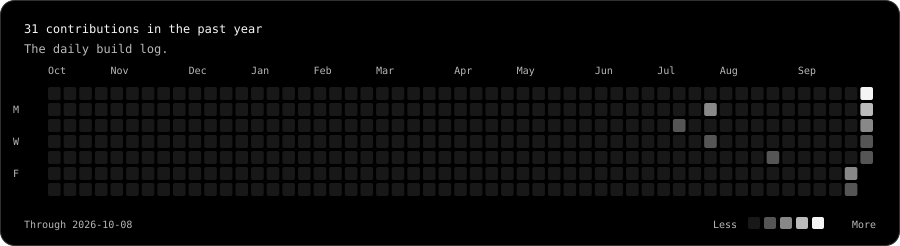

<picture>
  <source media="(max-width: 600px)" srcset="./assets/hero-mobile.svg" />
  
</picture>

<h1 align="center">Hi, I'm Rad.</h1>

  <b>Frontend Developer</b> &nbsp; / &nbsp; Starting my cybersecurity journey

  <a href="https://github.com/radware0?tab=repositories">My projects</a> &nbsp; · &nbsp;
  <a href="https://github.com/radware0/antwork">Antwork</a> &nbsp; · &nbsp;
  <a href="https://antwork-five.vercel.app/">Live demo</a>

 

## About me

I don't even listen to school lectures, fr.

I enjoy designing and developing apps through vibecoding, then learning how they work as I go. Building things is how I learn best.

I'm about to start learning cybersecurity — for the love of the game.

**My goal is simple: Work Hard, Play Hard.**

 

## Pinned project

<a href="https://github.com/radware0/antwork">
  <picture>
    <source media="(max-width: 600px)" srcset="./assets/antwork-mobile.svg" />
    
  </picture>
</a>

  <a href="https://github.com/radware0/antwork"><b>Explore the repo ↗</b></a> &nbsp; &nbsp;
  <a href="https://antwork-five.vercel.app/"><b>Try Antwork ↗</b></a>

 

## Tech stack

  
  
  
  
  
  
  

 

## Activity

<a href="https://github.com/radware0?tab=overview">
  <picture>
    <source media="(max-width: 600px)" srcset="./assets/activity-mobile.svg" />
    
  </picture>
</a>

 

Designing. Building. Learning. &nbsp; / &nbsp; @radware0

